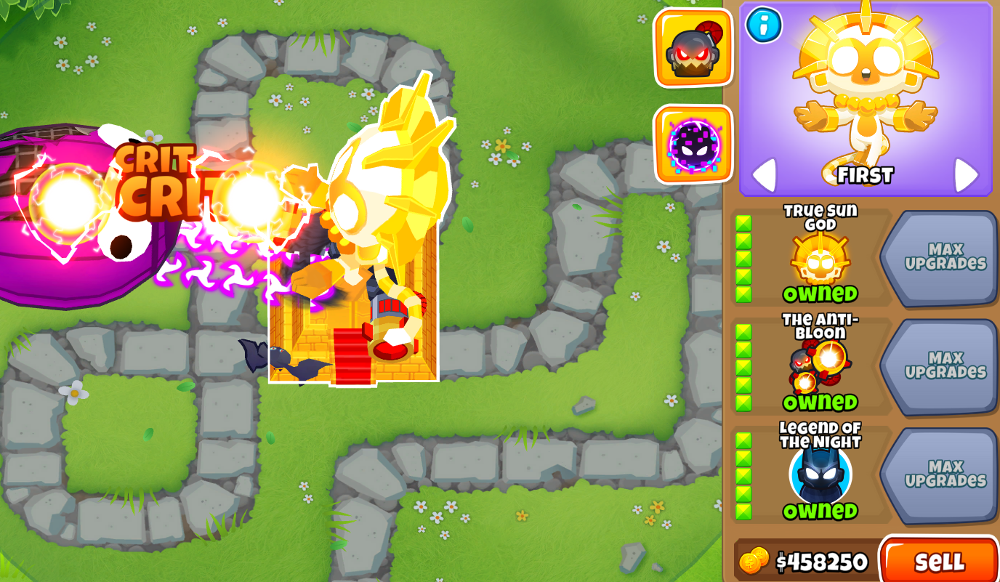

# Ultimate Crosspathing

Un mod **(modificacion)** de BTD6 añadiendo más combinaciones de mejoras mediante generación algorítmica.

### Resumen

Con este mod,en vez de que tus torres estén restringidas a 5 mejoras en un camino y 2 en otro, puedes usar las mejoras que quieras en cualquier camino.

El modo por defecto tiene las restricción de 7 mejoras totales con lo que puedes usar 430s, 331s, 322s, 511s, etc, pero si te sientes muy atrevido, hay un ajuste al final de la lista de opciones que puede activar para usar las 15 mejoras. También puedes activar/desactivar manualmente las torres que tendrán acceso a "Ultimate Crosspathing", y cambiar los ajustes ya no requiere un reinicio.

## Respuestas rápidas
### ¡Dice "Failed to download asset" cuando intento descargar/actualizar el mod usando el navegador de mods!
  El archivo "UltimateCrosspathing.dll" es bastante pesado. Si tu conexión a internet es relativamente lenta, podrías necesitar incrementar la duración de "Request Timeout" en los ajustes del Mod Helper.

### Dice "Failed to load Assembly... No Compatibility Layer Found!"
  ["BloonsTD6 Mod Helper"](https://github.com/gurrenm3/BTD-Mod-Helper/releases/latest) no está instalado correctamente. Asegurate de tener la versión más reciente y de que has extraído el archivo zip para tener un archivo en tu carpeta de mods con el nombre exacto "BloonsTD6 Mod Helper.dll".

  ### ¿¡¿El coste de una mejora es un número ridículamente alto?!?
  Eso es la forma de Ninja Kiwi de decir que no existe una torre a la que mejorar, lo que generalmente significa que el "Mod Helper" no está instalado correctamente. Mira la respuesta anterior. Revisa también los Logs del mod para ver si hubo algún error generando las torres. El coste en si no es el problema.

# Desarrollando "Ultimate Crosspathing"

Las dos configuraciones de "Ultimate Crosspathing, *Debug* y *Release* montan el mod de dos formas diferente.

- *Debug* - Por cada torre activada en los ajustes, y el número de mejoras que tengas activadas en los ajustes, las combinaciones correspondienes serán creadas desde cero en el juego. Los ajusted "Debug" de "Export Tower Bytes" será usable, y pulsarlo actualizará las clases y bytes "TowerLoader" para cada torre en el código fuente.

- *Release* - En vez de generar, carga las torres basado en que bytes ya han sido generados e incluidos. Los ajustes solo determinan sus capacidades de mejoras cruzadas en la partida.

El trabajo a la hora de arreglar "Ultimate Crosspathing" después de una actualización funciona más o menos así:

1. Ejecutar el mod en modo *"Debug"* en la nueva versión con solo el mono lanzadardos activado a 7 mejoras para comprobar si se rompe alguna parte de la generación.

2. Si esto es exitoso, ejecutar nuevamente con todas las torres activadas con 7 mejoras (Lleva unos pocos minutes) e intentar exportar los bytes.

3. Si esto es exitoso, cambiar al modo *"Release"* e intentar cargar todas las torres generadas.

4. Si esto es exitoso, intentar la generación final en modo *"Debug"* con todas las torres con 15 mejoras (Lleva más de 30 minutos) y exportar los bytes.

5. Si esto es exitoso, probar el mod y las torres en modo *"Release"* para ver si está preparado para el lanzamiento.
